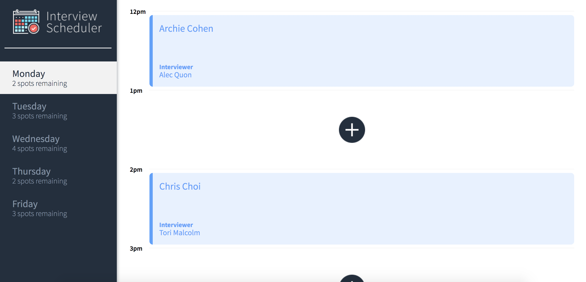
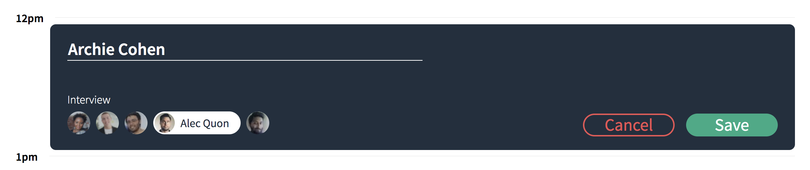
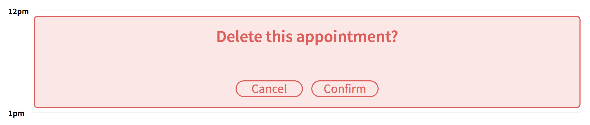

# Interview Scheduler

Interview Scheduler is a React-based app that allows users to create, edit, and delete appointments and are able to choose from a list of interviewers. The app supports testing from Jest, Storybook, and Cypress.

## Final Product







## Dependencies

- Axios
- Classnames
- Babel
- Storybook
- Sass
- React Test Renderer

## Setup

Install dependencies with `npm install`.

## Running Webpack Development Server

```sh
npm start
```

## Running Jest Test Framework

```sh
npm test
```

## Running Storybook Visual Testbed

```sh
npm run storybook
```
